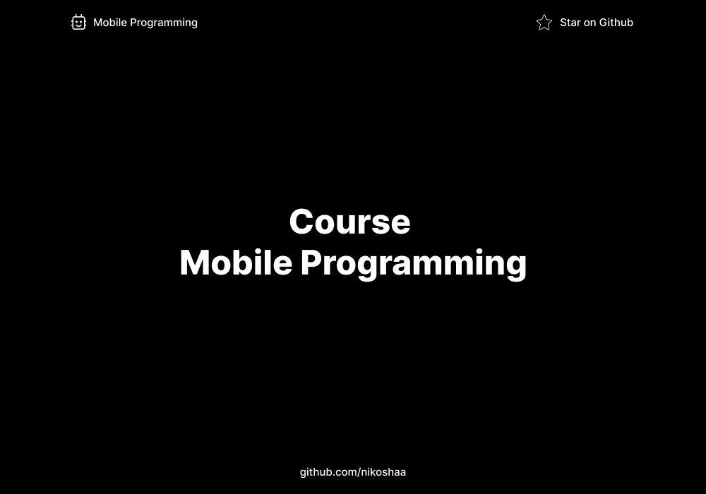

# Mobile Programming Course

## Overview

A Mobile Programming Course is designed to teach participants how to develop applications for mobile devices such as smartphones and tablets. 

## License

MIT License