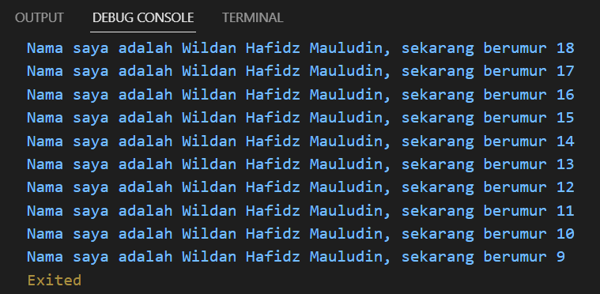

## Laporan Praktikum

## Week 2

```sh
Wildan Hafidz Mauludin
```

```sh
2141720007
```

## 1. Memodifikasi kode menjadi output yang diminta

### Source Code

```dart
void main() {
  for (int i = 18; i > 8; i--) {
    print("Nama saya adalah Wildan Hafidz Mauludin, sekarang berumur $i");
  }
}
```

### Output



## 2. Mengapa sangat penting untuk memahami bahasa pemrograman Dart sebelum kita menggunakan framework Flutter? Jelaskan!

### Jawab

Pemahaman bahasa pemrograman Dart sangat penting sebelum menggunakan framework Flutter karena Dart adalah bahasa pemrograman utama yang digunakan dalam pengembangan aplikasi Flutter.

## 3. Rangkumlah materi dari codelab ini menjadi poin-poin penting yang dapat Anda gunakan untuk membantu proses pengembangan aplikasi mobile menggunakan framework Flutter.

### Jawab

### 1. Bahasa Dart adalah Inti dari Framework Flutter:
Bahasa Dart digunakan sebagai bahasa inti dalam pengembangan aplikasi dengan Flutter.
Flutter membutuhkan bahasa modern seperti Dart untuk memberikan pengalaman terbaik kepada pengembang.

### 2. Mengapa Dart Dipilih untuk Flutter:
Dart dipilih karena tujuannya untuk menggabungkan kelebihan bahasa tingkat tinggi dengan fitur terbaru.
Dart dapat dikompilasi menjadi kode native untuk berbagai platform.
Dart memiliki alat yang produktif dan sistem garbage collection yang efisien.

### 3. Evolusi Dart:
Dart diluncurkan pada tahun 2011 dan mengalami perkembangan signifikan.
Dart awalnya fokus pada pengembangan web, tetapi kemudian berfokus pada pengembangan seluler, terutama dengan Flutter.
Dart menawarkan performa terbaik dan alat yang baik untuk proyek berskala besar.

### 4. Cara Eksekusi Kode Dart:
Kode Dart dapat dieksekusi melalui Dart VM (Just-In-Time atau Ahead-Of-Time) atau kompilasi menjadi JavaScript.
Dart VM mendukung JIT untuk debugging dan hot reload. Dart VM juga mendukung AOT untuk menghasilkan kode native untuk berbagai platform.

### 5. Struktur Dasar Bahasa Dart:
Dart memiliki struktur dasar yang mirip dengan banyak bahasa pemrograman lainnya.
Bahasa Dart adalah bahasa berorientasi objek dengan fitur seperti encapsulation, **inheritance**, **composition**, **abstraction**, dan **polymorphism**.
Operator dalam Dart digunakan sebagai method dengan sintaks khusus.
Dart mendukung operator aritmatika, increment/decrement, equality/relational, dan logical.

### 6. Main Function dalam Dart:
Function main() adalah entry point dalam setiap program Dart.
Dart VM mencari function main() untuk memulai eksekusi kode.
Tipe data yang dikembalikan oleh function perlu didefinisikan, dengan void menunjukkan bahwa tidak ada data yang dikembalikan.
Tanda kurung () menunjukkan parameter yang diterima oleh function (function main() tidak menerima parameter).

### 7. Function vs. Method:
Function berada di luar class, sedangkan method terikat pada turunan class dan memiliki referensi implisit ke instance class melalui this.

Berikut adalah poin-poin penting dari codelab yang Anda sebutkan yang dapat membantu dalam pengembangan aplikasi mobile menggunakan framework Flutter:

### 8. Pengenalan Dart:
Dart adalah bahasa pemrograman yang digunakan dalam pengembangan Flutter.
Dart adalah bahasa yang efisien, dapat digunakan untuk pengembangan web, server, desktop, dan seluler.

### 9. Sintaksis Dasar Dart:
Dart memiliki sintaksis yang bersih dan mudah dimengerti.
Pemahaman tentang variabel, tipe data, dan pernyataan kontrol sangat penting.
Contoh penggunaan variabel, penggunaan tipe data, dan penggunaan pernyataan if-else.

### 10. Fungsi dalam Dart:
Dart mendukung definisi dan pemanggilan fungsi.
Cara mendefinisikan fungsi dengan parameter dan nilai kembalian.
Contoh penggunaan fungsi dalam kode Dart.

### 11. Struktur Kontrol dalam Dart:
Pemahaman tentang pernyataan kontrol seperti if, else if, else, switch, dan for.
Bagaimana menggunakan pernyataan kontrol untuk mengendalikan alur program.

### 12. Tipe Data Dart:
Dart memiliki tipe data seperti int, double, String, bool, dan lain-lain.
Perbedaan antara tipe data yang dapat diubah (mutable) dan tipe data yang tidak dapat diubah (immutable).
Cara mendefinisikan variabel dengan tipe data tertentu.

### 13. Koleksi dan List dalam Dart:
Dart mendukung koleksi seperti List untuk mengelola sejumlah nilai.
Cara mendefinisikan dan mengakses elemen dalam List.
Metode umum yang digunakan dalam pengelolaan List.

### 14. Menggunakan Package dalam Dart:
Pengenalan tentang penggunaan paket atau libraries dalam Dart.
Contoh penggunaan paket-paket yang tersedia untuk pengembangan.

### 15. Penanganan Error dalam Dart:
Pengenalan tentang penanganan error dan exception dalam Dart.
Cara menggunakan try-catch untuk menangani kesalahan.