### Week 7

### Layout dan Navigasi

Wildan Hafidz Mauludin

2141720007

### Tugas Praktikum

1. Selesaikan Praktikum 1 sampai 4, lalu dokumentasikan dan push ke repository Anda berupa screenshot setiap hasil pekerjaan beserta penjelasannya di file README.md

2. Silakan implementasikan di project baru **"basic_layout_flutter"** dengan mengakses sumber ini: <https://docs.flutter.dev/codelabs/layout-basics>

**Answer**

### Jobsheet Layout Flutter Praktikum 1 sampai 4

[Jobsheet 07 - Layout dan Navigasi](https://jti-polinema.github.io/flutter-codelab/07-layout-navigasi/#0)

**Table of Content**

- [Praktikum 1: Membangun Layout di Flutter](#praktikum-1-membangun-layout-di-flutter)
- [Praktikum 2: Implementasi Button Row](#praktikum-2-implementasi-button-row)
- [Praktikum 3: Implementasi Text Section](#praktikum-3-implementasi-text-section)
- [Praktikum 4: Implementasi Image Section](#praktikum-4-implementasi-image-section)
- [Jobsheet Codelabs Basic Flutter Layout](#jobsheet-codelabs-layout-basics)

### Praktikum 1: Membangun Layout di Flutter

**Langkah 1: Buat Project Baru**

Buatlah sebuah project flutter baru dengan nama **layout_flutter**. Atau sesuaikan style laporan praktikum yang Anda buat.

**Answer Langkah 1**

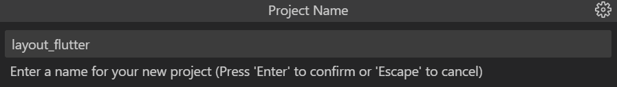

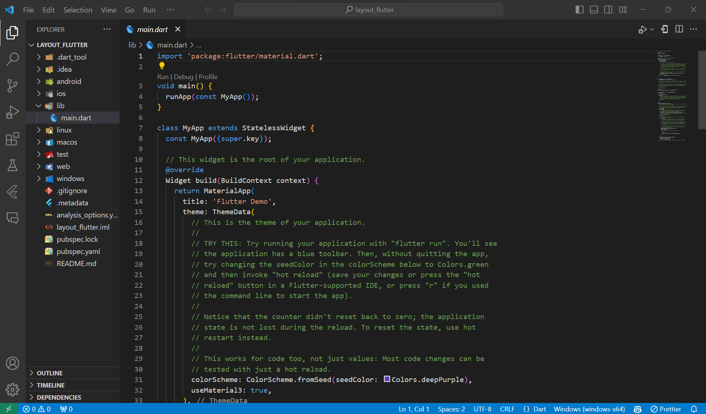

**Langkah 2: Buka file lib/main.dart**

Buka file `main.dart` lalu ganti dengan kode berikut. Isi nama dan NIM Anda di `text title`.

```dart
import 'package:flutter/material.dart';

void main() => runApp(const MyApp());

class MyApp extends StatelessWidget {
  const MyApp({super.key});

  @override
  Widget build(BuildContext context) {
    return MaterialApp(
      title: 'Flutter layout: Nama dan NIM Anda',
      home: Scaffold(
        appBar: AppBar(
          title: const Text('Flutter layout demo'),
        ),
        body: const Center(
          child: Text('Hello World'),
        ),
      ),
    );
  }
}
```

**Answer Langkah 2**

```dart
import 'package:flutter/material.dart';

void main() => runApp(const MyApp());

class MyApp extends StatelessWidget {
  const MyApp({super.key});

  @override
  Widget build(BuildContext context) {
    return MaterialApp(
      title: 'Flutter layout: Wildan Hafidz Mauludin | 2141720007',
      home: Scaffold(
        appBar: AppBar(
          title: const Text('Flutter layout demo'),
        ),
        body: const Center(
          child: Text('Hello World'),
        ),
      ),
    );
  }
}
```

**Langkah 3: Identifikasi Layout Diagram**

Langkah pertama adalah memecah tata letak menjadi elemen dasarnya:

- Identifikasi baris dan kolom.
- Apakah tata letaknya menyertakan kisi-kisi (grid)?
- Apakah ada elemen yang tumpang tindih?
- Apakah UI memerlukan tab?
- Perhatikan area yang memerlukan alignment, padding, atau borders.

**Langkah 4: Implementasi Title Row**

Pertama, Anda akan membuat kolom bagian kiri pada judul. Tambahkan kode berikut di bagian atas metode `build()` di dalam kelas `MyApp`:

```dart
Widget titleSection = Container(
  padding: const EdgeInsets.all(...),
  child: Row(
    children: [
      Expanded(
        /*Soal 1*/
        child: Column(
          crossAxisAlignment: ...,
          children: [
            /*Soal 2*/
            Container(
              padding: const EdgeInsets.only(bottom: ...),
              child: const Text(
                'Wisata Gunung di Batu',
                style: TextStyle(
                  fontWeight: FontWeight.bold,
                ),
              ),
            ),
            Text(
              'Batu, Malang, Indonesia',
              style: TextStyle(...),
            ),
          ],
        ),
      ),
      /*Soal 3*/
      Icon(
       ...,
        color: ...,
      ),
      const Text(...),
    ],
  ),
);
```

**Soal 1**

Letakkan widget `Column` di dalam widget `Expanded` agar menyesuaikan ruang yang tersisa di dalam widget Row. Tambahkan properti `crossAxisAlignment` ke `CrossAxisAlignment.start` sehingga posisi kolom berada di awal baris.

**Soal 2**

Letakkan baris pertama teks di dalam `Container` sehingga memungkinkan Anda untuk menambahkan padding = 8. Teks `‘Batu, Malang, Indonesia'` di dalam `Column`, set warna menjadi abu-abu.

**Soal 3**

Dua item terakhir di baris judul adalah ikon bintang, set dengan warna merah, dan teks "41". Seluruh baris ada di dalam `Container` dan beri padding di sepanjang setiap tepinya sebesar 32 piksel. Kemudian ganti isi `body text` `‘Hello World'` dengan variabel `titleSection` seperti berikut:

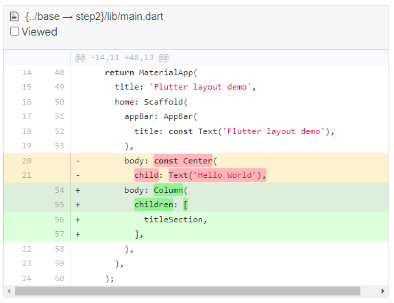

**Answer Langkah 4**

**Source Code Keseluruhan Praktikum 1**

```dart
Widget titleSection = Container(
      padding: const EdgeInsets.all(16.0),
      child: Row(
        children: [
          Expanded(
            /*Soal 1*/
            child: Column(
              crossAxisAlignment: CrossAxisAlignment.start,
              children: [
                /*Soal 2*/
                Container(
                  padding: const EdgeInsets.only(bottom: 8.0),
                  child: const Text(
                    'Kepulauan Raja Ampat',
                    style: TextStyle(
                      fontWeight: FontWeight.bold,
                    ),
                  ),
                ),
                Text(
                  'Papua Barat, Indonesia',
                  style: TextStyle(
                    color: Colors.grey[500],
                  ),
                ),
              ],
            ),
          ),
          /*Soal 3*/
          Icon(
            Icons.star,
            color: Colors.red[500],
          ),
          const Text('4,4'),
        ],
      ),
    );
```

**Output Praktikum 1: Membangun Layout di Flutter**

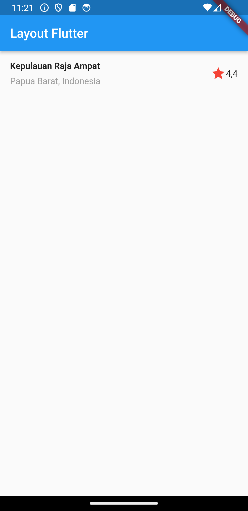

### Praktikum 2: Implementasi Button Row

Selesaikan langkah-langkah praktikum berikut ini dengan melanjutkan dari praktikum sebelumnya.

**Langkah 1: Buat method Column \_buildButtonColumn**

Bagian tombol berisi 3 kolom yang menggunakan tata letak yang sama—sebuah ikon di atas baris teks. Kolom pada baris ini diberi jarak yang sama, dan teks serta ikon diberi warna primer.

Karena kode untuk membangun setiap kolom hampir sama, buatlah metode pembantu pribadi bernama `buildButtonColumn()`, yang mempunyai parameter warna, `Icon` dan `Text`, sehingga dapat mengembalikan kolom dengan widgetnya sesuai dengan warna tertentu.

**lib/main.dart (\_buildButtonColumn)**

```dart
class MyApp extends StatelessWidget {
  const MyApp({super.key});

  @override
  Widget build(BuildContext context) {
    // ···
  }

  Column _buildButtonColumn(Color color, IconData icon, String label) {
    return Column(
      mainAxisSize: MainAxisSize.min,
      mainAxisAlignment: MainAxisAlignment.center,
      children: [
        Icon(icon, color: color),
        Container(
          margin: const EdgeInsets.only(top: 8),
          child: Text(
            label,
            style: TextStyle(
              fontSize: 12,
              fontWeight: FontWeight.w400,
              color: color,
            ),
          ),
        ),
      ],
    );
  }
}
```

**Answer Langkah 1**

```dart
import 'package:flutter/material.dart';

void main() {
  runApp(const MainApp());
}

class MainApp extends StatelessWidget {
  const MainApp({super.key});

  @override
  Widget build(BuildContext context) {
    Widget titleSection = Container(
      padding: const EdgeInsets.all(16.0),
      child: Row(
        children: [
          Expanded(
            child: Column(
              crossAxisAlignment: CrossAxisAlignment.start,
              children: [
                Container(
                  padding: const EdgeInsets.only(bottom: 8.0),
                  child: const Text(
                    'Kepulaan Raja Ampat',
                    style: TextStyle(
                      fontWeight: FontWeight.bold,
                    ),
                  ),
                ),
                Text(
                  'Papua Barat, Indonesia',
                  style: TextStyle(
                    color: Colors.grey[500],
                  ),
                ),
              ],
            ),
          ),
          Icon(
            Icons.star,
            color: Colors.red[500],
          ),
          const Text('4,4'),
        ],
      ),
    );
    /*Build Method Button Column*/
    Column _buildButtonColumn(Color color, IconData icon, String label) {
      return Column(
        mainAxisSize: MainAxisSize.min,
        mainAxisAlignment: MainAxisAlignment.center,
        children: [
          Icon(icon, color: color),
          Container(
            margin: const EdgeInsets.only(top: 8),
            child: Text(
              label,
              style: TextStyle(
                fontSize: 12,
                fontWeight: FontWeight.w400,
                color: color,
              ),
            ),
          ),
        ],
      );
    }
```

**Langkah 2: Buat widget buttonSection**

Buat Fungsi untuk menambahkan ikon langsung ke kolom. Teks berada di dalam `Container` dengan margin hanya di bagian atas, yang memisahkan teks dari ikon.

Bangun baris yang berisi kolom-kolom ini dengan memanggil fungsi dan set warna, `Icon`, dan teks khusus melalui parameter ke kolom tersebut. Sejajarkan kolom di sepanjang sumbu utama menggunakan `MainAxisAlignment.spaceEvenly` untuk mengatur ruang kosong secara merata sebelum, di antara, dan setelah setiap kolom. Tambahkan kode berikut tepat di bawah deklarasi `titleSection` di dalam metode `build()`:

**lib/main.dart (buttonSection)**

```dart
Color color = Theme.of(context).primaryColor;

Widget buttonSection = Row(
  mainAxisAlignment: MainAxisAlignment.spaceEvenly,
  children: [
    _buildButtonColumn(color, Icons.call, 'CALL'),
    _buildButtonColumn(color, Icons.near_me, 'ROUTE'),
    _buildButtonColumn(color, Icons.share, 'SHARE'),
  ],
);
```

**Answers Langkah 2**

```dart
import 'package:flutter/material.dart';

void main() {
  runApp(const MainApp());
}

class MainApp extends StatelessWidget {
  const MainApp({super.key});

  @override
  Widget build(BuildContext context) {
    Widget titleSection = Container(
      padding: const EdgeInsets.all(16.0),
      child: Row(
        children: [
          Expanded(
            child: Column(
              crossAxisAlignment: CrossAxisAlignment.start,
              children: [
                Container(
                  padding: const EdgeInsets.only(bottom: 8.0),
                  child: const Text(
                    'Kepulaan Raja Ampat',
                    style: TextStyle(
                      fontWeight: FontWeight.bold,
                    ),
                  ),
                ),
                Text(
                  'Papua Barat, Indonesia',
                  style: TextStyle(
                    color: Colors.grey[500],
                  ),
                ),
              ],
            ),
          ),
          Icon(
            Icons.star,
            color: Colors.red[500],
          ),
          const Text('4,4'),
        ],
      ),
    );
    /*Build Method Button Column*/
    Column _buildButtonColumn(Color color, IconData icon, String label) {
      return Column(
        mainAxisSize: MainAxisSize.min,
        mainAxisAlignment: MainAxisAlignment.center,
        children: [
          Icon(icon, color: color),
          Container(
            margin: const EdgeInsets.only(top: 8),
            child: Text(
              label,
              style: TextStyle(
                fontSize: 12,
                fontWeight: FontWeight.w400,
                color: color,
              ),
            ),
          ),
        ],
      );
    }
    /*Build Widget Button Section*/
    Color color = Theme.of(context).primaryColor;

    Widget buttonSection = Padding(
        padding: const EdgeInsets.only(top: 8.0, bottom: 8.0),
        child: Row(
          mainAxisAlignment: MainAxisAlignment.spaceEvenly,
          children: [
            _buildButtonColumn(color, Icons.call, 'CALL'),
            _buildButtonColumn(color, Icons.near_me, 'ROUTE'),
            _buildButtonColumn(color, Icons.share, 'SHARE'),
          ],
        ));
```

**Langkah 3: Tambah button section ke body**

Tambahkan variabel `buttonSection` ke dalam `body` seperti berikut:


**Answers Langkah 3**

```dart
return MaterialApp(
      title: 'MyApp',
      home: Scaffold(
        appBar: AppBar(
          title: const Text('Layout Flutter'),
        ),
        body: ListView(
          children: [
            titleSection,
            /*Add Button Section*/
            buttonSection,
            // Tambahkan widget lain di sini sesuai kebutuhan Anda.
          ],
        ),
      ),
    );
  }
}
```

**Source Code Keseluruhan Praktikum 2**

```dart
import 'package:flutter/material.dart';

void main() {
  runApp(const MainApp());
}

class MainApp extends StatelessWidget {
  const MainApp({super.key});

  @override
  Widget build(BuildContext context) {
    Widget titleSection = Container(
      padding: const EdgeInsets.all(16.0),
      child: Row(
        children: [
          Expanded(
            child: Column(
              crossAxisAlignment: CrossAxisAlignment.start,
              children: [
                Container(
                  padding: const EdgeInsets.only(bottom: 8.0),
                  child: const Text(
                    'Kepulaan Raja Ampat',
                    style: TextStyle(
                      fontWeight: FontWeight.bold,
                    ),
                  ),
                ),
                Text(
                  'Papua Barat, Indonesia',
                  style: TextStyle(
                    color: Colors.grey[500],
                  ),
                ),
              ],
            ),
          ),
          Icon(
            Icons.star,
            color: Colors.red[500],
          ),
          const Text('4,4'),
        ],
      ),
    );

    Column _buildButtonColumn(Color color, IconData icon, String label) {
      return Column(
        mainAxisSize: MainAxisSize.min,
        mainAxisAlignment: MainAxisAlignment.center,
        children: [
          Icon(icon, color: color),
          Container(
            margin: const EdgeInsets.only(top: 8),
            child: Text(
              label,
              style: TextStyle(
                fontSize: 12,
                fontWeight: FontWeight.w400,
                color: color,
              ),
            ),
          ),
        ],
      );
    }

    Color color = Theme.of(context).primaryColor;

    Widget buttonSection = Padding(
        padding: const EdgeInsets.only(top: 8.0, bottom: 8.0),
        child: Row(
          mainAxisAlignment: MainAxisAlignment.spaceEvenly,
          children: [
            _buildButtonColumn(color, Icons.call, 'CALL'),
            _buildButtonColumn(color, Icons.near_me, 'ROUTE'),
            _buildButtonColumn(color, Icons.share, 'SHARE'),
          ],
        ));
```

**Output Praktikum 2: Implementasi Button Row**

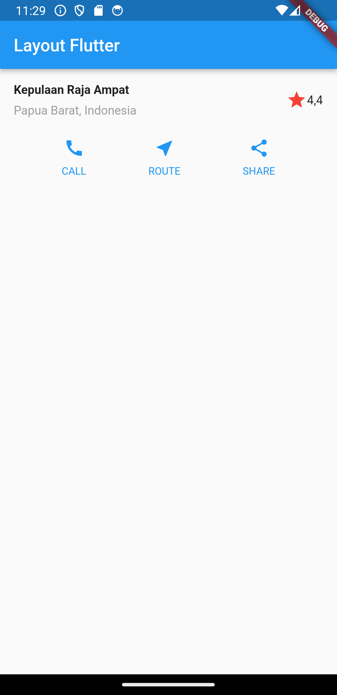

### Praktikum 3: Implementasi text section

Selesaikan langkah-langkah praktikum berikut ini dengan melanjutkan dari praktikum sebelumnya.

**Langkah 1: Buat widget textSection**

Tentukan bagian teks sebagai variabel. Masukkan teks ke dalam `Container` dan tambahkan padding di sepanjang setiap tepinya. Tambahkan kode berikut tepat di bawah deklarasi `buttonSection`:

```dart
Widget textSection = Container(
  padding: const EdgeInsets.all(32),
  child: const Text(
    'Carilah teks di internet yang sesuai '
    'dengan foto atau tempat wisata yang ingin '
    'Anda tampilkan. '
    'Tambahkan nama dan NIM Anda sebagai '
    'identitas hasil pekerjaan Anda. '
    'Selamat mengerjakan 🙂.',
    softWrap: true,
  ),
);
```

**Answers Langkah 1**

```dart
 Widget textSection = Container(
      padding: const EdgeInsets.all(20),
      child: const Text(
        'Kepulauan Raja Ampat adalah gugusan kepulauan yang berlokasi di barat bagian Semenanjung Kepala Burung Pulau Papua. Secara administrasi, gugusan ini berada di bawah Kabupaten Raja Ampat dan Kota Sorong, Provinsi Papua Barat Daya.'
        'Wildan Hafidz Mauludin | 2141720007',
        softWrap: true,
      ),
    );
```

Dengan memberi nilai `softWrap` = true, baris teks akan memenuhi lebar kolom sebelum membungkusnya pada batas kata.

**Langkah 2: Tambahkan variabel text section ke body**

Tambahkan widget variabel `textSection` ke dalam `body` seperti berikut:


**Answers Langkah 2**

```dart
return MaterialApp(
      title: 'MyApp',
      home: Scaffold(
        appBar: AppBar(
          title: const Text('Layout Flutter'),
        ),
        body: ListView(
          children: [
            titleSection,
            buttonSection,
            textSection,
            // Tambahkan widget lain di sini sesuai kebutuhan Anda.
          ],
        ),
      ),
    )
```

**Output Praktikum 3: Implementasi Text Section**

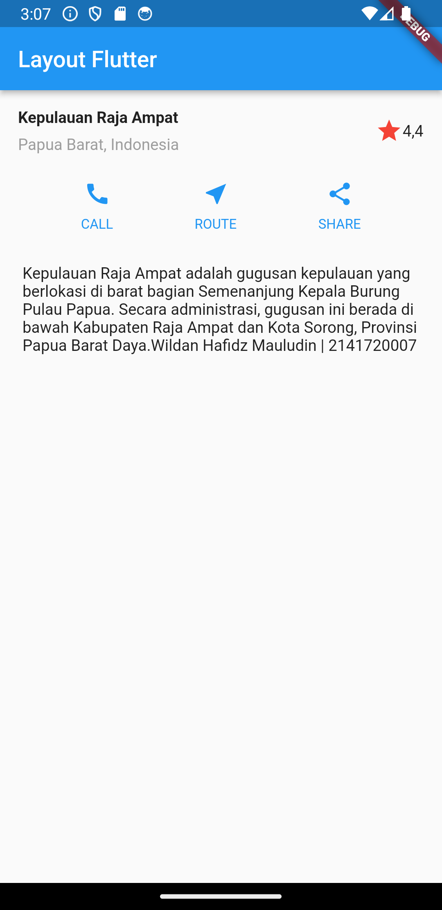

### Praktikum 4: Implementasi Image Section

Selesaikan langkah-langkah praktikum berikut ini dengan melanjutkan dari praktikum sebelumnya.

**Langkah 1: Siapkan aset gambar**

Anda dapat mencari gambar di internet yang ingin ditampilkan. Buatlah folder `images` di root project layout_flutter. Masukkan file gambar tersebut ke folder `images`, lalu set nama file tersebut ke file `pubspec.yaml` seperti berikut:


Contoh nama file gambar di atas adalah `lake.jpg`

**Answer**

```dart
  uses-material-design: true
  assets:
    - docs/materials/images.jpeg
```

`Langkah 2: Tambahkan gambar ke body`

Tambahkan aset gambar ke dalam `body `seperti berikut:

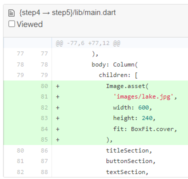

`BoxFit.cover` memberi tahu kerangka kerja bahwa gambar harus sekecil mungkin tetapi menutupi seluruh kotak rendernya.

**Answer**

```dart
return MaterialApp(
      title: 'MyApp',
      home: Scaffold(
        appBar: AppBar(
          title: const Text('Layout Flutter'),
        ),
        body: ListView(
          children: [
            Image.asset(
              'docs/materials/images.jpeg',
              width: 600,
              height: 240,
              fit: BoxFit.cover,
            ),
            titleSection,
            buttonSection,
            textSection
            // Tambahkan widget lain di sini sesuai kebutuhan Anda.
          ],
        ),
      ),
    );
```

**Langkah 3: Terakhir, ubah menjadi ListView**

Pada langkah terakhir ini, atur semua elemen dalam `ListView`, bukan Column, karena `ListView` mendukung scroll yang dinamis saat aplikasi dijalankan pada perangkat yang resolusinya lebih kecil.


**Answer**

```dart
 return MaterialApp(
      title: 'MyApp',
      home: Scaffold(
        appBar: AppBar(
          title: const Text('Layout Flutter'),
        ),
        body: ListView(
          children: [
            Image.asset(
              'docs/materials/images.jpeg',
              width: 600,
              height: 240,
              fit: BoxFit.cover,
            ),
            titleSection,
            buttonSection,
            textSection
            // Tambahkan widget lain di sini sesuai kebutuhan Anda.
          ],
        ),
      ),
```

**Output Praktikum 4: Implementasi Image Section**

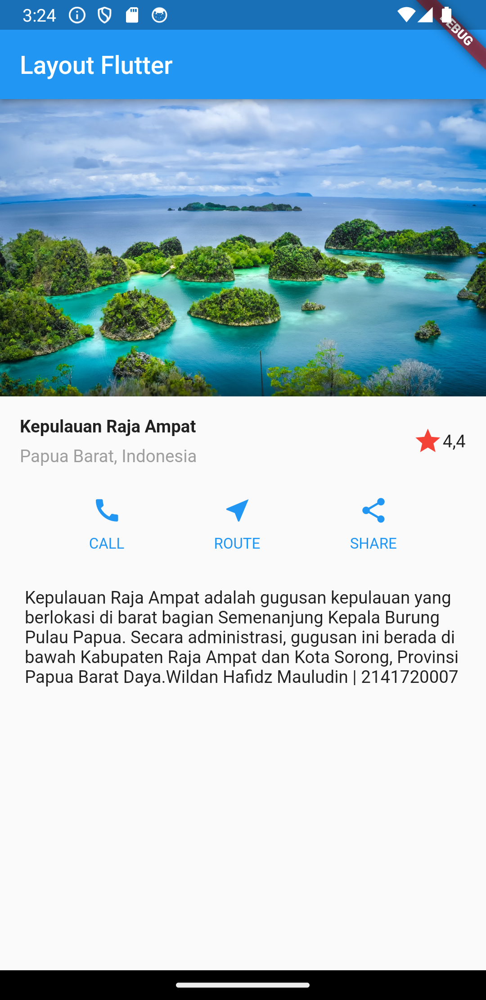

### Jobsheet Codelabs Layout Basics

[Jobsheet 07 - Codelabs Layout Basics](https://docs.flutter.dev/codelabs/layout-basics)

**Axis Size and Alignment**

**Main Axis Size**

Menentukan seberapa banyak ruang yang bisa digunakan oleh component.

_Max_


_Min_

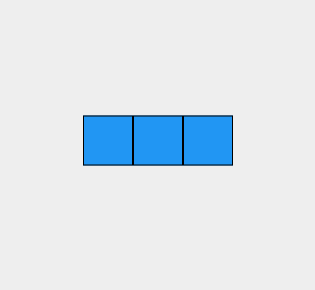

**Main Axis Alignment**

Menentukan bagaimana posisi berada component.

_start_

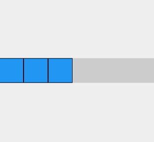

_end_

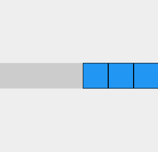

**Cross Axis Alignment**

Menentukan bagaimana posisi berada component pada posisi bersilangan.

_center_

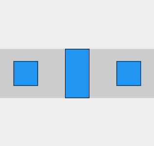

_start_

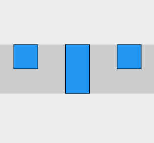

**Flexible Widget**

Digunakan untuk memberikan fleksibilitas kepada children terhadap parent widget.

- Tidak menggunakan Flexible untuk kotak ke-1

- FlexFix.tight untuk kotak ke-2

- FlexFit.loose untuk kotak ke-3

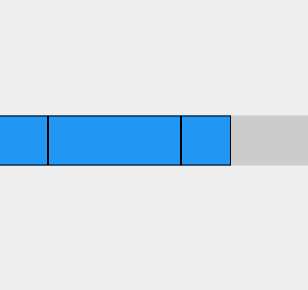

**Expanded Widget**

Digunakan untuk memberikan fleksibilitas kepada children untuk mengisi ruang pada parent.

- Kotak ke-1 dan ke-2 tidak menggunakan widget Expanded

- Kotak ke-3 menggunakan widget Expanded

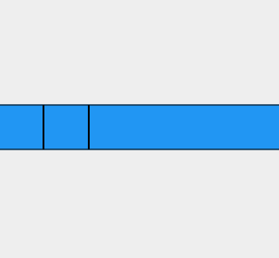

**SizedBox Widget**

Digunakan untuk memberikan ukuran widget yang sesuai dengan lebar dan tinggi yang telah ditentukan.

- Kotak ke-1 dan ke-2 tidak menggunakan widget SizedBox

- Kotak ke-3 menggunakan widget SizedBox

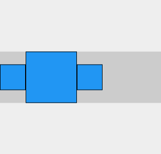

- SizedBox juga digunakan untuk memberikan space antar widget

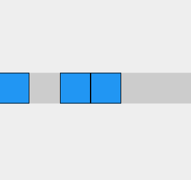

**Text Widget**

Digunakan untuk menampilkan text

- Menampilkan text dengan berbagai opsi seperti fon family, font size, dan color

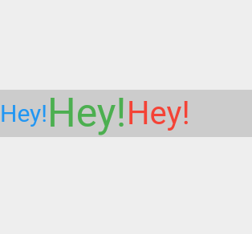

**Icon Widget**

Digunakan untuk menampilkan icon

- Menampilkan icon dengan opsi jenis icon, ukuran, dan warna

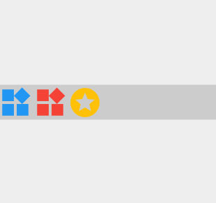

**Image Widget**

Digunakan untuk menampilkan gambar

- Jika gambar tidak berhasil di load

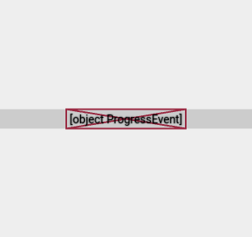

- Jika gambar berhasil di load

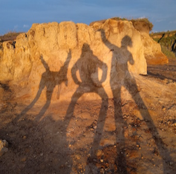

**Putting It All Together**

Membuat layout seperti ini

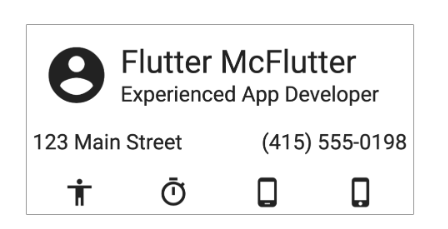

**Result**

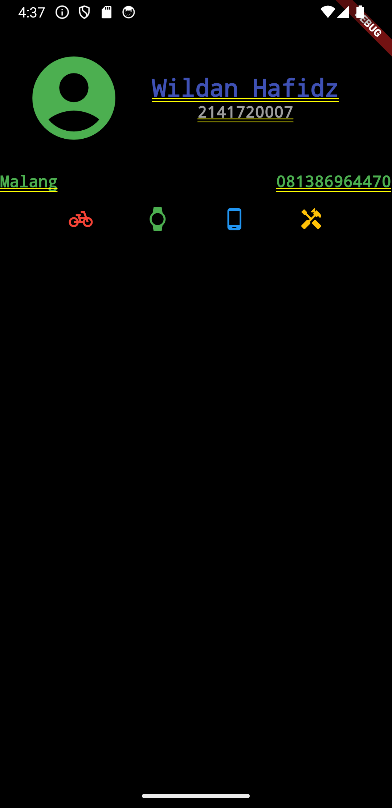
