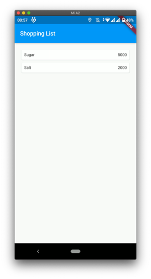
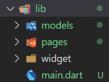
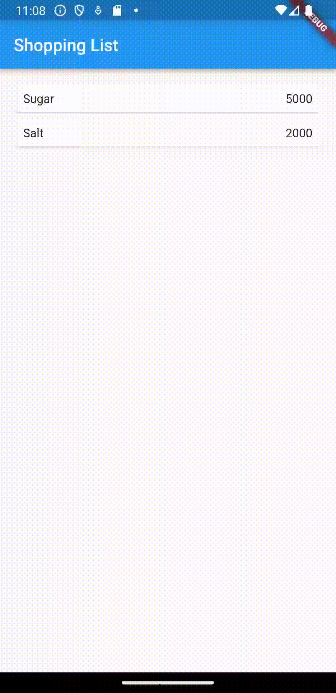

### Week 8

### Membangun Navigasi di Flutter

Wildan Hafidz Mauludin

2141720007

### Praktikum 5: Membangun Navigasi di Flutter

Selesaikan langkah-langkah praktikum berikut ini menggunakan editor Visual Studio Code (VS Code) atau Android Studio atau code editor lain kesukaan Anda. Materi ini dapat dimasukkan ke Laporan Praktikum folder **Week** atau **Pertemuan 08**.

Tampilan akhir yang akan Anda buat




Pada praktikum 5 ini anda akan belajar mengenai pembangunan aplikasi bergerak multi halaman. Aplikasi yang dikembangkan berupa kasus daftar barang belanja. Pada aplikasi ini anda akan belajar untuk berpindah halaman dan mengirimkan data ke halaman lainnya. Gambaran mockup hasil akhir aplikasi dapat anda lihat pada gambar di atas (mockup dibuat sederhana, sehingga Anda mempunyai banyak ruang untuk berkreasi). Desain aplikasi menampilkan sebuah `ListView` widget yang datanya bersumber dari `List`. Ketika item ditekan, data akan dikirimkan ke halaman berikutnya.

**Langkah 1: Siapkan project baru**

Sebelum melanjutkan praktikum, buatlah sebuah project baru Flutter dengan nama belanja dan susunan folder seperti pada gambar berikut. Penyusunan ini dimaksudkan untuk mengorganisasi kode dan widget yang lebih mudah.



**Langkah 2: Mendefinisikan Route**

Buatlah dua buah file dart dengan nama `home_page.dart` dan `item_page.dart` pada folder **pages**. Untuk masing-masing file, deklarasikan `class HomePage` pada file `home_page.dart` dan `ItemPage` pada `item_page.dart`. Turunkan class dari `StatelessWidget`. Gambaran potongan kode dapat anda lihat sebagai berikut.

```dart
class ItemPage extends StatelessWidget {
  const ItemPage({super.key});
  @override
  Widget build(BuildContext context) {
```

**Langkah 3: Lengkapi Kode di main.dart**

Setelah kedua halaman telah dibuat dan didefinisikan, bukalah file `main.dart`. Pada langkah ini anda akan mendefinisikan **Route** untuk kedua halaman tersebut. Definisi penamaan **route** harus bersifat **unique**. Halaman **HomePage** didefinisikan sebagai /. Dan halaman **ItemPage** didefinisikan sebagai **/item**. Untuk mendefinisikan halaman awal, anda dapat menggunakan `named argument initialRoute`. Gambaran tahapan ini, dapat anda lihat pada potongan kode berikut.

```dart
Widget build(BuildContext context) {
    return MaterialApp(
      initialRoute: '/',
      routes: {
        '/': (context) => HomePage(),
        '/item': (context) => const ItemPage(),
      },
    );
  }
}
```

**Langkah 4: Membuat data model**

Sebelum melakukan perpindahan halaman dari `HomePage` ke `ItemPage`, dibutuhkan proses pemodelan data. Pada desain mockup, dibutuhkan dua informasi yaitu nama dan harga. Untuk menangani hal ini, buatlah sebuah file dengan nama `item.dart` dan letakkan pada folder **models**. Pada file ini didefinisikan pemodelan data yang dibutuhkan. Ilustrasi kode yang dibutuhkan, dapat anda lihat pada potongan kode berikut.

```dart
class Item {
  String? name;
  int? price;

  Item({this.name, this.price});
}
```

**Langkah 5: Lengkapi kode di class HomePage**

Pada halaman `HomePage` terdapat `ListView` widget. Sumber data `ListView` diambil dari model List dari object Item. Gambaran kode yang dibutuhkan untuk melakukan definisi model dapat anda lihat sebagai berikut.

```dart
final List<Item> items = [
    Item(name: 'Sugar', price: 5000),
    Item(name: 'Salt', price: 2000),
  ];
```

**Langkah 6: Membuat ListView dan itemBuilder**

Untuk menampilkan `ListView` pada praktikum ini digunakan `itemBuilder`. Data diambil dari definisi model yang telah dibuat sebelumnya. Untuk menunjukkan batas data satu dan berikutnya digunakan widget `Card`. Kode yang telah umum pada bagian ini tidak ditampilkan. Gambaran kode yang dibutuhkan dapat anda lihat sebagai berikut.

```dart
      body: Container(
        margin: const EdgeInsets.all(15),
        child: ListView.builder(
          itemCount: items.length,
          itemBuilder: (context, index) {
            final item = items[index];
            return Material(
              child: InkWell(
                onTap: () {
                  Navigator.pushNamed(context, routeName, arguments: item);
                },
                child: Card(
                  child: Container(
                    margin: const EdgeInsets.all(8),
                    child: Row(
                      children: [
                        Expanded(child: Text(item.name.toString())),
                        Expanded(
                          child: Text(
                            item.price.toString(),
                            textAlign: TextAlign.end,
                          ),
                        )
                      ],
                    ),
                  ),
                ),
              ),
            );
          },
        ),
      ),
```

Jalankan aplikasi pada emulator atau pada device anda.

**Langkah 7: Menambahkan aksi pada ListView**

Item pada ListView saat ini ketika ditekan masih belum memberikan aksi tertentu. Untuk menambahkan aksi pada ListView dapat digunakan widget `InkWell` atau `GestureDetector`. Perbedaan utamanya `InkWell` merupakan material widget yang memberikan efek ketika ditekan. Sedangkan `GestureDetector` bersifat umum dan bisa juga digunakan untuk gesture lain selain sentuhan. Pada praktikum ini akan digunakan widget `InkWell`.

Untuk menambahkan sentuhan, letakkan cursor pada widget pembuka `Card`. Kemudian gunakan shortcut quick fix dari VSCode (**Ctrl +** . pada Windows atau **Cmd +** . pada MacOS). Sorot menu `wrap with widget...` Ubah nilai widget menjadi `InkWell` serta tambahkan named argument `onTap` yang berisi fungsi untuk berpindah ke halaman `ItemPage`. Ilustrasi potongan kode dapat anda lihat pada potongan berikut.

```dart
return InkWell(
    onTap: () {
        Navigator.pushNamed(context, '/item');
    }
)
```

Jalankan aplikasi kembali dan pastikan ListView dapat disentuh dan berpindah ke halaman berikutnya. Periksa kembali jika terdapat kesalahan.

**Output Praktikum**



**Tugas Praktikum**

1. Untuk melakukan pengiriman data ke halaman berikutnya, cukup menambahkan informasi arguments pada penggunaan **Navigator**. Perbarui kode pada bagian **Navigator** menjadi seperti berikut.

```dart
Navigator.pushNamed(context, '/item', arguments: item);
```

2. Pembacaan nilai yang dikirimkan pada halaman sebelumnya dapat dilakukan menggunakan `ModalRoute`. Tambahkan kode berikut pada blok fungsi build dalam halaman `ItemPage`. Setelah nilai didapatkan, anda dapat menggunakannya seperti penggunaan variabel pada umumnya.

(https://docs.flutter.dev/cookbook/navigation/navigate-with-arguments)

```dart
final itemArgs = ModalRoute.of(context)!.settings.arguments as Item;
```

3. Pada hasil akhir dari aplikasi **belanja** yang telah anda selesaikan, tambahkan atribut foto produk, stok, dan rating. Ubahlah tampilan menjadi `GridView` seperti di aplikasi marketplace pada umumnya.

4. Silakan implementasikan `Hero widget` pada aplikasi **belanja** Anda dengan mempelajari dari sumber ini:

https://docs.flutter.dev/cookbook/navigation/hero-animations

5. Sesuaikan dan modifikasi tampilan sehingga menjadi aplikasi yang menarik. Selain itu, pecah widget menjadi kode yang lebih kecil. Tambahkan **Nama** dan **NIM** di footer aplikasi **belanja** Anda.

6. Selesaikan Praktikum Navigasi dan Rute tersebut, lalu dokumentasikan dan push ke repository Anda berupa screenshot setiap hasil pekerjaan beserta penjelasannya di file `README.md`. Kumpulkan link commit repository GitHub Anda ke spreadsheet yang telah disediakan!

**Answer**

**Source Code item.dart**

```dart
class Item {
  String name, imageUrl;
  int price, sold;
  double rating;

  Item(
      {required this.name,
      required this.price,
      required this.imageUrl,
      required this.sold,
      required this.rating});
}
```

**Source Code home_page.dart**

```dart
import 'package:belanja/models/item.dart';
import 'package:flutter/material.dart';
import 'package:belanja/widgets/card_widget.dart';
import 'package:belanja/widgets/bottom_widget.dart';

class HomePage extends StatelessWidget {
  final List<Item> items = [
    Item(
        name: 'Gula',
        price: 14500,
        imageUrl: 'assets/sugar.jpg',
        sold: 47,
        rating: 5.0),
    Item(
        name: 'Garam',
        price: 6690,
        imageUrl: 'assets/salt.jpg',
        sold: 51,
        rating: 4.0),
    Item(
        name: 'Coffee',
        price: 67490,
        imageUrl: 'assets/coffee.jpg',
        sold: 23,
        rating: 4.1),
    Item(
        name: 'Kripik',
        price: 6490,
        imageUrl: 'assets/kripik.jpg',
        sold: 34,
        rating: 4.6),
    Item(
        name: 'Kecap',
        price: 12390,
        imageUrl: 'assets/lada.jpg',
        sold: 16,
        rating: 4.6),
    Item(
        name: 'Susu',
        price: 17970,
        imageUrl: 'assets/milk.jpg',
        sold: 26,
        rating: 5.0),
  ];

  @override
  Widget build(BuildContext context) {
    return Scaffold(
        appBar: AppBar(
          title: const Text('Shopping List'),
        ),
        body: CardWidget(items: items),
        bottomNavigationBar: const BottomWidget());
  }
}
```

**Source Code item_page.dart**

```dart
import 'package:belanja/widgets/detailsItem_widget.dart';
import 'package:flutter/material.dart';

class ItemPage extends StatelessWidget {
  const ItemPage({super.key});

  @override
  Widget build(BuildContext context) {
    return Scaffold(
      appBar: AppBar(
        title: const Text('Item Details'),
      ),
      body: const DetailsItem(),
    );
  }
}
```

**Source Code bottom_widget.dart**

```dart
import 'package:flutter/material.dart';

class BottomWidget extends StatelessWidget {
  const BottomWidget({super.key});

  @override
  Widget build(BuildContext context) {
    return BottomAppBar(
      child: Container(
        padding: const EdgeInsets.all(16),
        decoration: const BoxDecoration(
          color: Colors.blue,
        ),
        child: const Row(
          mainAxisAlignment: MainAxisAlignment.spaceBetween,
          children: [
            Text(
              'Wildan Hafidz Mauludin',
              style: TextStyle(
                color: Colors.white,
                fontSize: 16,
              ),
            ),
            Text(
              '2141720007',
              style: TextStyle(
                color: Colors.white,
                fontSize: 16,
              ),
            ),
          ],
        ),
      ),
    );
  }
}
```

**Source Code card_widget.dart**

```dart
import 'package:flutter/material.dart';
import 'package:belanja/models/item.dart';

class CardWidget extends StatelessWidget {
  // const CardWidget({super.key});
  final List<Item> items;

  const CardWidget({required this.items});

  @override
  Widget build(BuildContext context) {
    return Scaffold(
      body: GridView.builder(
        gridDelegate: const SliverGridDelegateWithFixedCrossAxisCount(
          crossAxisCount: 2, // Menampilkan 2 item per baris
          childAspectRatio: 0.7, // Mengatur rasio lebar-tinggi item
        ),
        itemCount: items.length,
        itemBuilder: (context, index) {
          final item = items[index];
          return ItemCard(item: item, context: context);
        },
      ),
    );
  }
}

class ItemCard extends StatelessWidget {
  final Item item;
  final BuildContext context;

  const ItemCard({required this.item, required this.context});

  @override
  Widget build(BuildContext context) {
    return InkWell(
      onTap: () {
        Navigator.pushNamed(context, '/item', arguments: item);
      },
      child: Card(
        child: Padding(
          padding: const EdgeInsets.all(
              8), // Tambahkan padding pada keseluruhan Card
          child: Column(
            crossAxisAlignment: CrossAxisAlignment.start,
            children: [
              Hero(
                tag: 'productImage${item.name}',
                child: AspectRatio(
                  aspectRatio:
                      1, // Rasio lebar-tinggi 1:1 untuk ukuran yang sama
                  child: Image.asset(item.imageUrl, fit: BoxFit.cover),
                ),
              ),
              Row(
                mainAxisAlignment: MainAxisAlignment
                    .spaceBetween, // Agar rating berada di sebelah kanan
                children: [
                  Padding(
                    padding: const EdgeInsets.only(
                        top: 8), // Padding di atas teks "name"
                    child: Text(
                      item.name,
                      style: const TextStyle(
                        fontWeight: FontWeight.bold,
                        fontSize: 16,
                      ),
                    ),
                  ),
                  Row(
                    children: [
                      const Icon(Icons.star, color: Colors.amber),
                      Text(
                        item.rating.toString(),
                        style: const TextStyle(
                          color: Colors.amber,
                          fontSize: 14,
                        ),
                      ),
                    ],
                  ),
                ],
              ),
              Padding(
                padding: const EdgeInsets.symmetric(vertical: 8),
                child: Text(
                  'Rp. ${item.price}',
                  style: const TextStyle(
                    color: Colors.deepOrange,
                    fontSize: 14,
                  ),
                ),
              ),
              Text(
                'Stok: ${item.sold}',
                style: const TextStyle(
                  color: Colors.grey,
                  fontSize: 14,
                ),
              ),
            ],
          ),
        ),
      ),
    );
  }
}
```

**Source Code detailsItem_widget.dart**

```dart
import 'package:flutter/material.dart';
import 'package:belanja/models/item.dart';

class DetailsItem extends StatelessWidget {
  const DetailsItem({super.key});

  @override
  Widget build(BuildContext context) {
    final itemArgs = ModalRoute.of(context)!.settings.arguments as Item;
    return Scaffold(
      body: Padding(
        padding: const EdgeInsets.all(16.0),
        child: Column(
          crossAxisAlignment: CrossAxisAlignment.start,
          children: [
            Hero(
              tag: 'productImage${itemArgs.name}',
              child: Image.asset(itemArgs.imageUrl),
            ),
            const SizedBox(
                height: 16), // Tambahkan jarak antara gambar dan teks
            Row(
              mainAxisAlignment: MainAxisAlignment.spaceBetween,
              children: [
                Text(
                  '${itemArgs.name}',
                  style: const TextStyle(
                    fontWeight: FontWeight.bold,
                    fontSize: 24,
                  ),
                ),
                Row(
                  children: [
                    const Icon(Icons.star, color: Colors.amber),
                    Text(
                      itemArgs.rating.toString(),
                    ),
                  ],
                ),
              ],
            ),
            const SizedBox(height: 8), // Tambahkan jarak antara nama dan harga
            Row(
              mainAxisAlignment: MainAxisAlignment.spaceBetween,
              children: [
                Text(
                  'Rp. ${itemArgs.price}',
                  style: const TextStyle(
                    color: Colors.deepOrange,
                    fontSize: 20,
                  ),
                ),
                Text(
                  'Stok: ${itemArgs.sold}',
                  style: const TextStyle(
                    color: Colors.grey,
                    fontSize: 16,
                  ),
                ),
              ],
            ),
          ],
        ),
      ),
    );
  }
}
```

**Source Code main.dart**

```dart
import 'package:belanja/pages/home_page.dart';
import 'package:belanja/pages/item_page.dart';
import 'package:flutter/material.dart';

void main() {
  runApp(MaterialApp(
    debugShowCheckedModeBanner: false,
    initialRoute: '/',
    routes: {
      '/': (context) => HomePage(),
      '/item': (context) => const ItemPage(),
    },
  ));
}
```

**Output Tugas**


