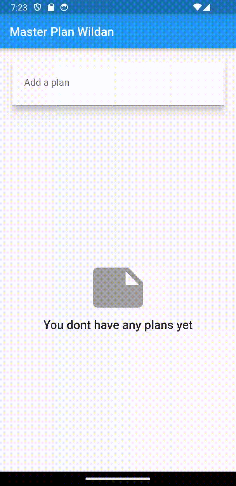

### Week 11

### Dasar State Management

Wildan Hafidz Mauludin

2141720007

### Tugas Praktikum 1 - Dasar State dengan Model-View

1. Selesaikan langkah-langkah praktikum tersebut, lalu dokumentasikan berupa GIF hasil akhir praktikum beserta penjelasannya di file README!

**Answer**

2. Jelaskan maksud dari langkah 4 pada praktikum tersebut! Mengapa dilakukan demikian?

**Answer**

Langkah 4 berfungsi untuk mengekspor kode pada `plan.dart` dan `task.dart` sehingga pada `plan_screen.dart` hanya mengimport file `data_layer.dart` saja untuk mengimpor kedua file tersebut.

3. Mengapa perlu variabel plan di langkah 6 pada praktikum tersebut? Mengapa dibuat konstanta?

**Answer**

Variabel `plan` digunakan untuk menginisialisasikan class `Plan` yang telah dibuat pada `plan.dart`. Konstanta digunakan agar variabel tersebut tidak dapat diubah nilainya.

4. Lakukan capture hasil dari Langkah 9 berupa GIF, kemudian jelaskan apa yang telah Anda buat!

**Answer**

Disini saya sudah membuat `todo list app` yang dapat menambahkan dan checklist task.

5. Apa kegunaan method pada Langkah 11 dan 13 dalam lifecyle state ?

**Answer**

Fungsi `initstate` digunakan untuk menginisialisasi state pada widget. Fungsi `dispose` digunakan untuk membersihkan state pada widget. 6. Kumpulkan laporan praktikum Anda berupa link commit atau repository GitHub ke spreadsheet yang telah disediakan!

### Praktikum 2 - Mengelola Data Layer dengan InheritedWidget dan InheritedNotifier

1. Selesaikan langkah-langkah praktikum tersebut, lalu dokumentasikan berupa GIF hasil akhir praktikum beserta penjelasannya di file README! Jika Anda menemukan ada yang error atau tidak berjalan dengan baik, silakan diperbaiki sesuai dengan tujuan aplikasi tersebut dibuat.

**Answer**

2. Jelaskan mana yang dimaksud InheritedWidget pada langkah 1 tersebut! Mengapa yang digunakan InheritedNotifier?

**Answer**

`InheritedWidget` adalah widget yang dapat digunakan untuk mengakses data dari widget lainnya. `InheritedNotifier` digunakan untuk mengakses data dari widget lainnya dan dapat memberitahu widget lainnya jika terjadi perubahan data.

3. Jelaskan maksud dari method di langkah 3 pada praktikum tersebut! Mengapa dilakukan demikian?

**Answer**

Fungsi `completedCount` pada langkah 3 digunakan untuk mendapatkan jumlah task yang sudah selesai. Sedangkan fungsi `completenessMessage` digunakan untuk menampilkan teks taks yang sudah selesai

4. Lakukan capture hasil dari Langkah 9 berupa GIF, kemudian jelaskan apa yang telah Anda buat!

**Answer**

Disini digunakan widget `safeArea` untuk menampilkan jumlah task yang sudah selesai pada bagian bawah.

5. Kumpulkan laporan praktikum Anda berupa link commit atau repository GitHub ke spreadsheet yang telah disediakan!

### Praktikum 3 - State di Multiple Screens

1. Selesaikan langkah-langkah praktikum tersebut, lalu dokumentasikan berupa GIF hasil akhir praktikum beserta penjelasannya di file README! Jika Anda menemukan ada yang error atau tidak berjalan dengan baik, silakan diperbaiki sesuai dengan tujuan aplikasi tersebut dibuat.

2. Berdasarkan Praktikum 3 yang telah Anda lakukan, jelaskan maksud dari gambar diagram berikut ini!

**Answer**

Diagram widget tree sebelah kiri mencerminkan struktur aplikasi saat sedang berada dalam proses pembuatan rencana baru. Pada tahap ini, pengguna berinteraksi dengan `PlanCreatorScreen`, di mana mereka dapat membuat rencana baru. Data rencana dan tampilan daftar rencana diatur oleh `PlanProvider`, yang menjadi bagian dari widget tree di bawah `MaterialApp`. Sebagai bagian dari tata letak, terdapat `Column` yang berisi `TextField` dan `Expanded` untuk menata secara vertikal dan memanfaatkan ruang yang ada.

Sementara itu, diagram widget tree sebelah kanan merepresentasikan tampilan utama (`PlanScreen`) setelah navigasi atau perubahan rute. Di sini, pengguna dapat melihat daftar rencana yang ada. Data rencana juga dikelola oleh `PlanProvider`, yang tetap berada di root widget tree untuk memungkinkan akses lintas tampilan. `Column`, `Expanded`, dan `SafeArea` digunakan untuk menyusun elemen-elemen dengan optimal, termasuk `ListView` untuk menampilkan daftar rencana. Selain itu, terdapat elemen `Text` di bawah `SafeArea` yang mungkin menampilkan pesan tentang kelengkapan rencana.

Navigasi antara kedua diagram ini terjadi saat pengguna berpindah antara langkah-langkah pembuatan rencana (`PlanCreatorScreen`) dan melihat rencana yang ada (`PlanScreen`).

3. Lakukan capture hasil dari Langkah 14 berupa GIF, kemudian jelaskan apa yang telah Anda buat!

**Answer**

Setelah langkah-langkah diimplementasikan pada Praktikum 3, aplikasi Flutter "Master Plan" dapat mengelola daftar rencana melalui **PlanProvider**. Modifikasi dilakukan pada <kbd>PlanProvider</kbd>, <kbd>main.dart</kbd>, dan <kbd>plan_screen.dart</kbd> untuk mengintegrasikan manajemen state yang berpusat pada daftar rencana.

Pada <kbd>plan_screen.dart</kbd>, adanya perubahan untuk mendukung daftar rencana, termasuk penggunaan getter untuk mengakses rencana. Selain itu, diperkenalkan juga **PlanCreatorScreen** yang memungkinkan pengguna menambahkan rencana baru.

4. Kumpulkan laporan praktikum Anda berupa link commit atau repository GitHub ke spreadsheet yang telah disediakan!
