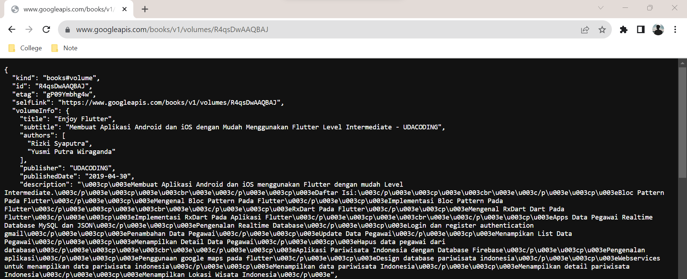
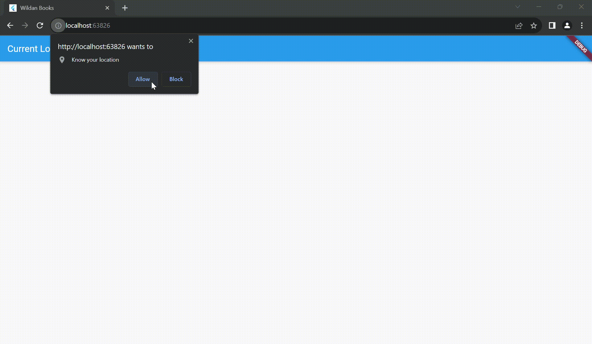
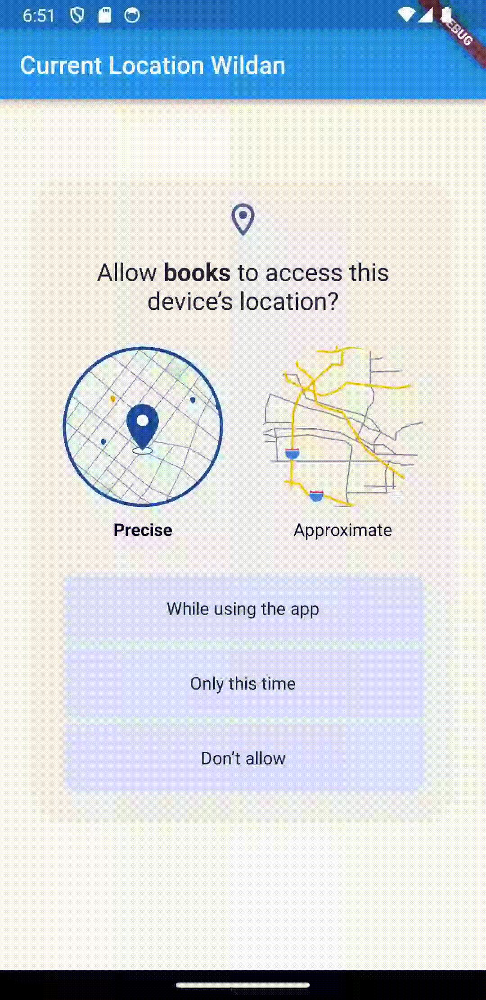

### Week 12

### Pemrograman Asynchronous

Wildan Hafidz Mauludin

2141720007

### Praktikum 1: Mengunduh Data dari Web Service (API)

**Soal 1**

Tambahkan **nama panggilan Anda** pada `title` app sebagai identitas hasil pekerjaan Anda.

**Jawab**

```dart
class MyApp extends StatelessWidget {
  const MyApp({super.key});

  @override
  Widget build(BuildContext context) {
    return MaterialApp(
      title: 'Wildan Books',
      theme: ThemeData(
          primarySwatch: Colors.blue,
          visualDensity: VisualDensity.adaptivePlatformDensity),
      home: const FuturePage(),
    );
  }
}
```

**Soal 2**

Carilah judul buku favorit Anda di Google Books, lalu ganti ID buku pada variabel `path` di kode tersebut. Caranya ambil di URL browser Anda seperti gambar berikut ini.

**Jawab**


Kemudian cobalah akses di browser URI tersebut dengan lengkap seperti ini. Jika menampilkan data JSON, maka Anda telah berhasil. Lakukan _capture_ milik Anda dan tulis di `README` pada laporan praktikum. Lalu lakukan commit dengan pesan "**W12: Soal 2**".



**Soal 3**

Jelaskan maksud kode langkah 5 tersebut terkait `substring` dan `catchError`!

**Jawab**

`Substring` pada kode tersebut berfungsi untuk mengambil teks dari index 0 sampai 450. Sedangkan `catchError` berfungsi untuk menangkap error yang terjadi pada kode tersebut.

Capture hasil praktikum Anda berupa GIF dan lampirkan di README. Lalu lakukan commit dengan pesan "**W12: Soal 3**".

**Jawab**


### Praktikum 2: Menggunakan await/async untuk menghindari callbacks

**Soal 4**

Jelaskan maksud kode langkah 1 dan 2 tersebut!

**Jawab**

Pada langkah 1 menginisialisasikan 3 method dengan menggunakan fungsi `Future.delayed` dengan lama 3 detik dengan return nilai tertentu.

Pada langkah ke 2 menginisialiasasikan method `count()` yang digunakan untuk memanggil ketiga method sebelumnya dan mengganti variable result dengan jumlah nilai kembali dari ketiga method tersebut.

Capture hasil praktikum Anda berupa GIF dan lampirkan di README. Lalu lakukan commit dengan pesan "**W12: Soal 4**".

**Jawab**


### Praktikum 3: Menggunakan Completer di Future

**Soal 5**

Jelaskan maksud kode langkah 2 tersebut!

**Jawab**

Fungsi kode langkah 2 adalah untuk menginisialisasikan `Completer` untuk mengembalikan nilai hasil `Future` nantinnya.

Capture hasil praktikum Anda berupa GIF dan lampirkan di README. Lalu lakukan commit dengan pesan "**W12: Soal 5**".

**Jawab**


**Soal 6**

Jelaskan maksud perbedaan kode langkah 2 dengan langkah 5-6 tersebut!

**Jawab**

Perbedaan dari kedua kode tersebut adalah `Completer` akan mengembalikan status `Future` apakah berhasil atau tidak sedangkan `Async Await` mengembalikan hasil `Future` pada fungsi tersebut.

Capture hasil praktikum Anda berupa GIF dan lampirkan di README. Lalu lakukan commit dengan pesan "**W12: Soal 6**".

**Jawab**


### Praktikum 4: Memanggil Future secara paralel

**Soal 7**

Capture hasil praktikum Anda berupa GIF dan lampirkan di README. Lalu lakukan commit dengan pesan "**W12: Soal 7"**.

**Jawab**


**Soal 8**

Jelaskan maksud perbedaan kode langkah 1 dan 4!

**Jawab**

Perbedaan Kode pada langkah 1 dan 4

Langkah 1 menggunakan `FutureGroup` untuk mengelola sejumlah future secara manual. `FutureGroup` memungkinkan kita menambahkan future satu per satu dan menutupnya agar tidak dapat menambahkan future lagi. Setelah itu menggunakan loop `for` untuk menjumlahkan hasil dari semua future yang dijalankan. Setelah semua future selesai, hasilnya diubah menjadi string dan diatur dalam `setState` untuk memperbarui tampilan.

Sedangkan langkah 4 menggunakan `Future.wait` untuk menunggu sampai semua future selesai. `Future.wait` mengembalikan future tunggal yang menunggu sampai semua future dalam daftar selesai. Setelah itu menggunakan loop `for` untuk menjumlahkan hasil dari semua future yang dijalankan. Setelah semua future selesai, hasilnya diubah menjadi string dan diatur dalam `setState` untuk memperbarui tampilan.

### Praktikum 5: Menangani Respon Error pada Async Code

**Soal 9**

Capture hasil praktikum Anda berupa GIF dan lampirkan di README. Lalu lakukan commit dengan pesan "**W12: Soal 9"**.

**Jawab**


**Soal 10**

Panggil method `handleError()` tersebut di `ElevatedButton`, lalu run. Apa hasilnya? Jelaskan perbedaan kode langkah 1 dan 4!

**Jawab**

Setelah method `handleError()` dipanggil, maka outputnya akan tetap sama, pesan kesalahan _'Exception: Something terrible happened!'_ akan tetap ditampilkan. Namun kedua kode pada langkah 1 dan 4 tersebut memiliki perbedaan dalam menangani error yang terjadi.

Langkah 1 menggunakan then untuk menangani hasil sukses dari `returnError()`. Kemudian menggunakan catchError untuk menangkap dan menangani kesalahan yang mungkin terjadi selama operasi asynchronous. Terakhir, menggunakan `whenComplete` untuk menentukan tindakan yang akan dilakukan setelah operasi selesai, baik dengan sukses atau dengan kesalahan.

Sedangkan langkah 4 menggunakan blok `try-catch` untuk menangkap kesalahan yang mungkin terjadi selama operasi asynchronous. Dengan menggunakan try-catch ini akan mengizinkan lebih banyak kontrol atas kode yang dijalankan ketika kesalahan terjadi dan memberikan pesan kesalahan di dalam result. Jika ada kesalahan, hasil kesalahan dikirim ke dalam setState untuk pembaruan tampilan. Blok finally akan selalu dijalankan, baik operasi berhasil atau gagal.

Jadi, jika operasi `returnError()` berhasil, maka _'Success'_ akan ditampilkan di dalam variabel result. Jika terjadi kesalahan, pesan kesalahan yang dihasilkan oleh Exception akan ditampilkan. Selain itu, pesan _'Complete'_ akan dicetak ke konsol dalam kedua kasus, karena blok `whenComplete` atau finally selalu dijalankan.

**Hasil**


### Praktikum 6: Menggunakan Future dengan StatefulWidget

**Soal 11**

Tambahkan **nama panggilan Anda** pada tiap properti `title` sebagai identitas pekerjaan Anda.

**Jawab**

```dart
Widget build(BuildContext context) {
    return Scaffold(
      appBar: AppBar(title: const Text('Current Location Wildan')),
      body: Center(child: Text(myPosition)),
    );
  }
```


**Soal 12**

- Jika Anda tidak melihat animasi loading tampil, kemungkinan itu berjalan sangat cepat. Tambahkan delay pada method `getPosition()` dengan kode `await Future.delayed(const Duration(seconds: 3));`

- Apakah Anda mendapatkan koordinat GPS ketika run di browser? Mengapa demikian?

- Capture hasil praktikum Anda berupa GIF dan lampirkan di README. Lalu lakukan commit dengan pesan "`W12: Soal 12`".

**Jawab**

Jika melakukan running project pada browser, koordinat GPS tetap bisa muncul atau didapatkan.

Hal ini dikarenakan Flutter web menggunakan API Geolocation yang disediakan oleh browser secara langsung. Pada Flutter web tersebut, izin untuk mengakses lokasi dikelola oleh browser, bukan pada sistem operasi (seperti Android pada platform mobile).

Oleh karena itu meskipun tidak menambahkan izin secara implisit pada `AndroidManifest`, koordinat GPS tetap bisa didapatkan pada browser, namun tetap dengan izin pengguna.

Berikut ini adalah hasil ketika running pada web browser



Sedangkan berikut ini adalah running pada device android



### Praktikum 7: Manajemen Future dengan FutureBuilder

**Soal 13**

- Apakah ada perbedaan UI dengan praktikum sebelumnya? Mengapa demikian?

**Jawab**

Dari kedua praktikum tersebut tidak memiliki perbedaan UI. Keduanya tetap menampilkan koordinat Geolokasi dengan layout yang sama. Hal ini terjadi karena keduanya masih mengambil lokasi secara sinkron dalam blok `initState`. Sebenarnya untuk pembaruan UI terdapat perbedaan.

Pada kasus pertama, `setState` digunakan setelah mendapatkan posisi untuk memperbarui variabel state `myPosition`, yang kemudian digunakan dalam UI.

Sementara pada kasus kedua, position adalah objek `Future<Position>` yang digunakan dalam `FutureBuilder`. Meskipun tidak ada pemanggilan `setState` secara langsung, FutureBuilder secara otomatis mengelola pembaruan UI sesuai dengan status future yang berkaitan.

Namun pada akhirnya, hasil tampilan UI terlihat sama karena keduanya memiliki penundaan atau delay yang sama, yakni 3 detik.

Selain itu, UI bisa terlihat sama karena `FutureBuilder` secara otomatis mengelola pembaruan UI, bahkan tanpa pemanggilan setState langsung.

- Capture hasil praktikum Anda berupa GIF dan lampirkan di README. Lalu lakukan commit dengan pesan "**W12: Soal 13**".

**Jawab**


Seperti yang kita lihat, menggunakan FutureBuilder lebih efisien, clean, dan reactive dengan Future bersama UI.
