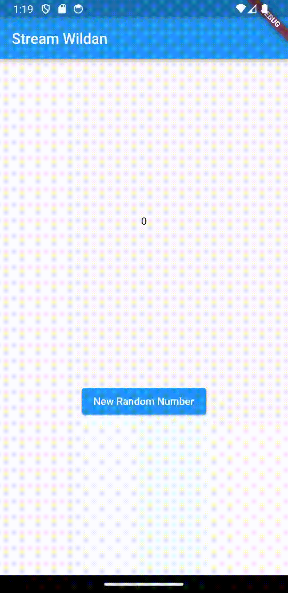
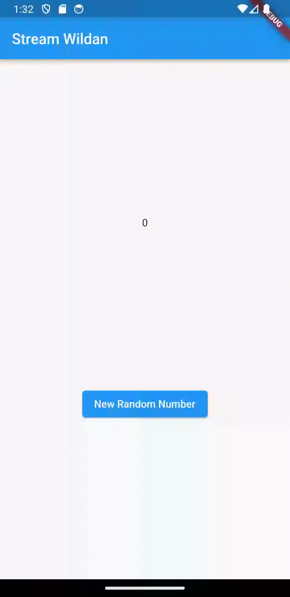
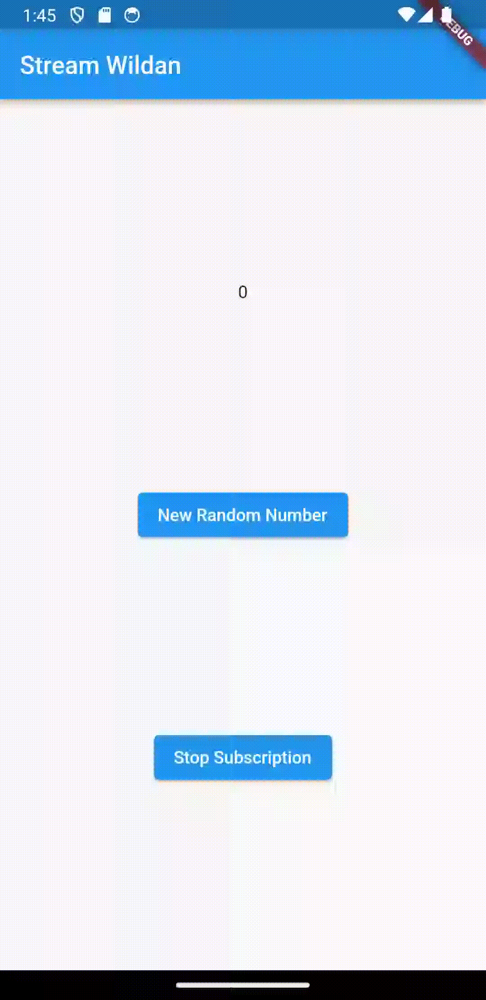
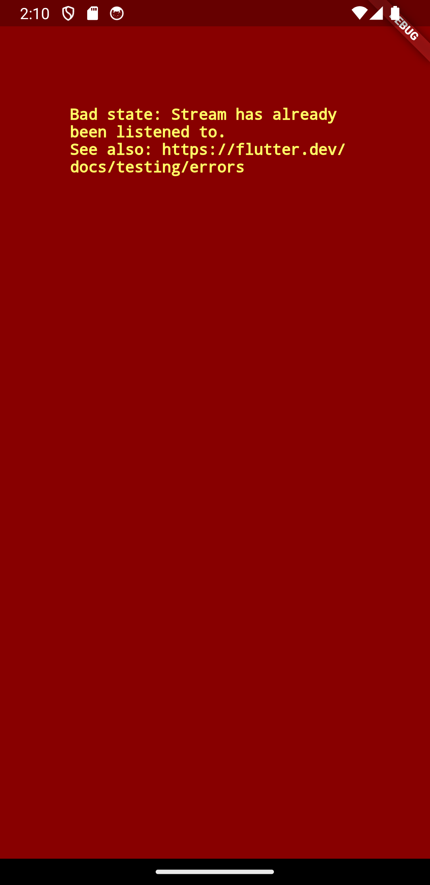
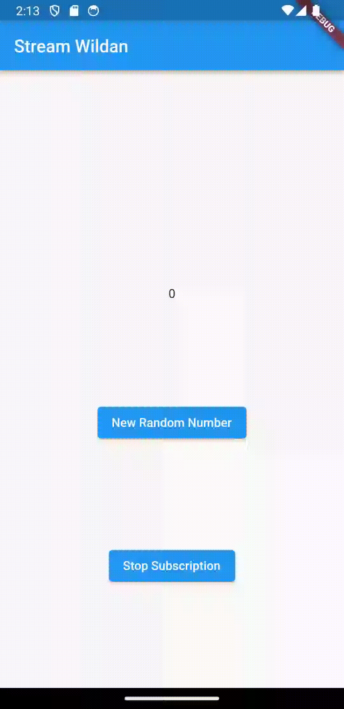
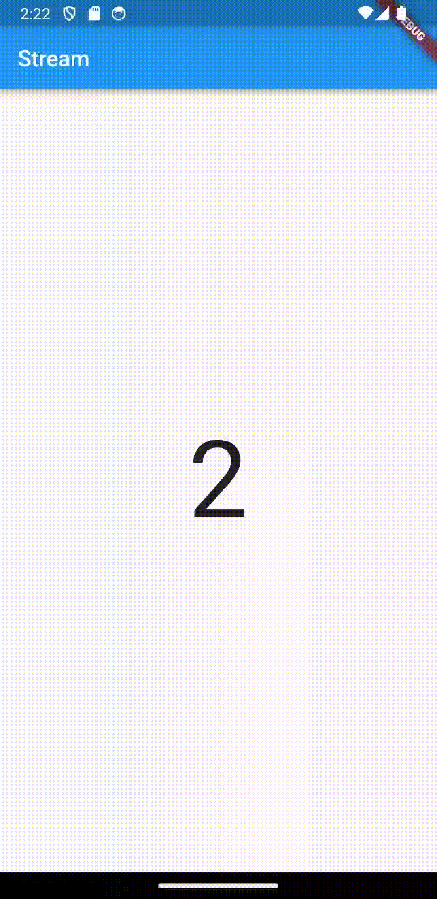
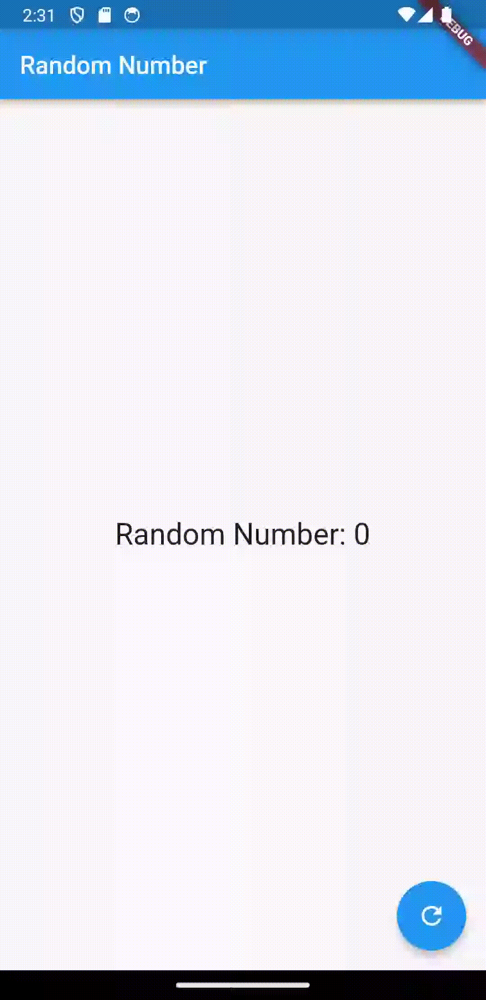

### Week 13

### Lanjutan State Management dengan Streams

Wildan Hafidz Mauludin

2141720007

### Praktikum 1: Dart Streams

**Soal 1**

- Tambahkan **nama panggilan Anda** pada `title` app sebagai identitas hasil pekerjaan Anda.

**Jawab**

```dart
class MyApp extends StatelessWidget {
  const MyApp({super.key});

  @override
  Widget build(BuildContext context) {
    return MaterialApp(
      title: 'Stream Wildan',
      theme: ThemeData(
        primarySwatch: Colors.blue,
      ),
      home: const StreamHomePage(),
    );
  }
}
```

- Gantilah warna tema aplikasi sesuai kesukaan Anda.

**Jawab**

```dart
return MaterialApp(
      title: 'Stream Wildan',
      theme: ThemeData(
        primarySwatch: Colors.blue,
      ),
      home: const StreamHomePage(),
    );
```

- Lakukan commit hasil jawaban Soal 1 dengan pesan "**W13: Jawaban Soal 1**".

**Jawab**

[W13: Jawaban Soal 1](https://github.com/nikoshaa/2141720007-mobile-2023/commit/d3d35324ee622a15d18b294f3a462a1210ad9400)

**Soal 2**

- Tambahkan 5 warna lainnya sesuai keinginan Anda pada variabel `colors` tersebut.

**Jawab**

```dart
import 'package:flutter/material.dart';

class ColorStream {
  final List<Color> colors = [
    Colors.blueGrey,
    Colors.amber,
    Colors.deepPurple,
    Colors.lightBlue,
    Colors.teal,
    // Tambah 5 warna
    Colors.lightGreenAccent,
    Colors.deepOrange,
    Colors.deepOrangeAccent,
    Colors.lime,
    Colors.lightGreen,
  ];
}
```

- Lakukan commit hasil jawaban Soal 2 dengan pesan "**W13: Jawaban Soal 2**"

**Jawab**

[W13: Jawaban Soal 2](https://github.com/nikoshaa/2141720007-mobile-2023/commit/5557361e38674d71ed66dfcc38fc4fe905615f2c)

**Soal 3**

- Jelaskan fungsi keyword yield\* pada kode tersebut!

**Jawab**

Keyword `yield*` pada kode tersebut digunakan untuk menghasilkan nilai dari generator lain. Dalam hal ini, `Stream.periodic` adalah generator yang menghasilkan nilai berulang setiap detik.

Keyword `yield*` mengambil nilai dari generator `Stream.periodic` dan mengembalikannya sebagai nilai dari generator yang sedang dibuat.

Dalam kode tersebut, generator yang dibuat menghasilkan nilai dari generator `Stream.periodic`.

- Apa maksud isi perintah kode tersebut?

**Jawab**

Kode tersebut mendefinisikan kelas `ColorStream` yang memiliki metode `getColors` sebagai asynchronous generator function, yang mana akan menghasilkan stream warna yang berulang setiap detik, dengan warna yang ditampilkan merupakan warna yang diambil dari daftar warna yang telah ditentukan.

- Lakukan commit hasil jawaban Soal 3 dengan pesan "W13: Jawaban Soal 3"

**Jawab**

[W13: Jawaban Soal 3](https://github.com/nikoshaa/2141720007-mobile-2023/commit/200c62aa386e87e7ec520a149775f337a8b88d8f)

**Soal 4**

- Capture hasil praktikum Anda berupa GIF dan lampirkan di README.

**Jawab**


- Lakukan commit hasil jawaban Soal 4 dengan pesan "**W13: Jawaban Soal 4**"

**Jawab**

[W13: Jawaban Soal 4](https://github.com/nikoshaa/2141720007-mobile-2023/commit/204f44913b0d5ec82b3549ae177bfd846cf618d0)

**Soal 5**

- Jelaskan perbedaan menggunakan `listen` dan `await for` pada langkah 9!

**Jawab**

- `await for` digunakan untuk mendengarkan stream secara langsung di dalam metode `changeColor()`. Hal ini memungkinkan penggunaan `await`, sehingga proses yang ada di dalam blok perulangan akan menunggu hingga stream mengeluarkan nilai sebelum melanjutkan ke langkah berikutnya. Dalam konteks ini, setiap kali stream mengeluarkan nilai baru(warna baru), blok `setState` akan dieksekusi untuk memperbarui tampilan.

- `listen` digunakan untuk menambahkan listener ke dalam stream. Dalam hal ini, setiap kali stream mengeluarkan nilai baru, callback yang ada dalam `listen` akan dipanggil. Dalam kode ini, tidak ada penggunaan `await`, sehingga pembaruan tampilan dapat terjadi secara asynchronous, dan blok `setState` akan dieksekusi setiap kali stream mengeluarkan nilai baru.

- Pada intinya, `await for` digunakan ketika kita ingin menunggu setiap iterasi (stream mengeluarkan iterasi) selesai sebelum melanjutkan ke iterasai selanjutnya. Sedangkan `listen` digunakan ketika ingin menangani nilai secara asinkron, tanpa perlu menunggu satu iterasi seelsai sebelum melanjutkan ke iterasi berikutnya.

- Lakukan commit hasil jawaban Soal 5 dengan pesan "**W13: Jawaban Soal 5**"

**Jawab**

[W13: Jawaban Soal 5](https://github.com/nikoshaa/2141720007-mobile-2023/commit/daaae14d4d936e6ebbab2c22e2dd1f26fbdd07e4)

### Praktikum 2: Stream controllers dan sinks

**Soal 6**

- Jelaskan maksud kode langkah 8 dan 10 tersebut!

**Jawab**

- Langkah 8: pada kode ini, awalnya membuat objek `NumberStream` yang menyediakan suatu steam controller. Saat aplikasi diinisialisasi, kita menghubungkan controller tersebut ke suatu stream. Ketika stream mengeluarkan nilai baru, sebagai contoh adalah angka baru, maka tampilan akan diperbarui dengan nilai baru tersebut melalui `setState()`.

- Langkah 10: pada langkah ini membuat suatu metode yang akan menambahkan angka random atau acak ke dalam stream. Metode ini menggunakan objek `Random` untuk menghasilkan angka acak. Kemudian angka acak tersebut ditambahkan ke dalam stream menggunakan metode `addNumberToSink` pada objek `numberStream`.

- Capture hasil praktikum Anda berupa GIF dan lampirkan di README.

**Jawab**


- Lalu lakukan commit dengan pesan "**W13: Jawaban Soal 6**".

**Jawab**

[W13: Jawaban Soal 6](https://github.com/nikoshaa/2141720007-mobile-2023/commit/d9d8a37a036ee735f05bd3e615da594dca17e422)

**Soal 7**

- Jelaskan maksud kode langkah 13 sampai 15 tersebut!

**Jawab**

Kode langkah 13 sampai 15 digunakan untuk menghandle error pada `stream` melalui fungsi `addError()` pada stream.

Kode `onError()` digunakan untuk menghandle error `stream`. Sedangkan `numberStream.addError()` digunakan untuk menginisialisasi error pada `stream`.

Jika terjadi error atau kesalahan selama proses iterasi atau ketika stream mengembalikan nilai, maka nilai dari `lastNumber` diatur menjadi -1.



- Kembalikan kode seperti semula pada Langkah 15, comment `addError()` agar Anda dapat melanjutkan ke praktikum 3 berikutnya.

**Jawab**

```dart
 void addRandomNumber() {
    Random random = Random();
    int myNum = random.nextInt(10);
    numberStream.addNumberToSink(myNum);
    // numberStream.addError();
  }
```

- Lalu lakukan commit dengan pesan "**W13: Jawaban Soal 7**".

**Jawab**

[W13: Jawaban Soal 7](https://github.com/nikoshaa/2141720007-mobile-2023/commit/454790641260c041f684932a6dc4efa4060cbd34)

### Praktikum 3: Injeksi data ke streams

**Soal 8**

- Jelaskan maksud kode langkah 1-3 tersebut!

**Jawab**

Maksud dari kode langkah 1-3 digunakanan untuk merubah data pada saat `stream`. Nah pada kode tersebut number akan dikalikan `10` apabila mendapatkan data dan bernilai `-1` apabila terjadi error.

- Capture hasil praktikum Anda berupa GIF dan lampirkan di README.

**Jawab**



Lalu lakukan commit dengan pesan "**W13: Jawaban Soal 8**".

**Jawab**

[W13: Jawaban Soal 8](https://github.com/nikoshaa/2141720007-mobile-2023/commit/86776eba47beae8f32ab45a6bbaedaf793557533)

### Praktikum 4: Subscribe ke stream events

**Soal 9**

- Jelaskan maksud kode langkah 2, 6 dan 8 tersebut!

**Jawab**

- Fungsi dari langkah 2 untuk menginisialisasi `stream`.

- Fungsi dari langkah 6 untuk menghentikan `streaming` menerima data.

- Fungsi dari langkah 8 untuk menginisilaisasi nilai random dan menghandle `error` pada stream.

- Capture hasil praktikum Anda berupa GIF dan lampirkan di README.

**Jawab**



Lalu lakukan commit dengan pesan "**W13: Jawaban Soal 9**".

**Jawab**

[W13: Jawaban Soal 9](https://github.com/nikoshaa/2141720007-mobile-2023/commit/e89714b10f9ce7a1d426a98c96ec586669ce694b)

### Praktikum 5: Multiple stream subscriptions

**Soal 10**

- Jelaskan maksud kode langkah 2, 6 dan 8 tersebut!

**Jawab**

Error terjadi karena stream telan menghandle satu `listener` yaitu `subscription`, tetapi `subscription2` mencoba untuk listen maka akan menghasilkan error.



**Soal 11**

- Jelaskan mengapa hal itu bisa terjadi?

**Jawab**

Hal itu terjadi karena terdapat dua listeners yang berbeda yaitu `subscription` dan `subscription2` yang menghandle stream yang sama sehingga akan `values` akan diubah oleh dua `listener` tersebut yang pada kasus ini perubahannya sama.

- Capture hasil praktikum Anda berupa GIF dan lampirkan di README.

**Jawab**



Lalu lakukan commit dengan pesan "**W13: Jawaban Soal 10,11**".

**Jawab**

[W13: Jawaban Soal 10,11](https://github.com/nikoshaa/2141720007-mobile-2023/commit/cc479bbe2e2707ecef9cf4561174ca3b5e78e51c)

### Praktikum 6: StreamBuilder

**Soal 12**

- Jelaskan maksud kode pada langkah 3 dan 7 !

**Jawab**

- Kode langkah 3 digunakan untuk membuat `stream` yang mengenerate random number.

- Sedangkan kode langkah 7 digunakan untuk mengimplimentasikan `stream` menggunakan `StreamBuilder`. Jika stream mendapatkan data maka akan menampilkan `Text` dengan nilai `snapshot.data` dan jika terjadi error maka akan melakukan log.

- Capture hasil praktikum Anda berupa GIF dan lampirkan di README.

**Jawab**



Lalu lakukan commit dengan pesan "**W13: Jawaban Soal 12**".

**Jawab**

[W13: Jawaban Soal 12](https://github.com/nikoshaa/2141720007-mobile-2023/commit/c3d8f0cdfe7991685d28b865b9648d96d4c0e933)

### Praktikum 7: BLoC Pattern

**Soal 13**

- Jelaskan maksud praktikum ini! Dimanakah letak konsep pola BLoC-nya?

**Jawab**

Praktikum ini menjelaskan bagaimana menggunakan BLoC pattern pada flutter.

Konsep BLoC terletak pada `random_bloc.dart` yang menghasilkan `stream` untuk random number. Pada `random_screen` digunakan variable `_bloc` untuk menginisialisasi `random_bloc` dan `StreamBuilder` untuk menghandle stream yang dihasilkan oleh `random_bloc`.

Terdapat tombol refresh yang digunakan untuk menggenerate random number baru dengan mentrigger fungsi `sink` pada `_generateRandomController` pada `random_bloc.dart`.

- Capture hasil praktikum Anda berupa GIF dan lampirkan di README.

**Jawab**



Lalu lakukan commit dengan pesan "**W13: Jawaban Soal 13**".

**Jawab**

[W13: Jawaban Soal 13](https://github.com/nikoshaa/2141720007-mobile-2023/commit/c689a2851a3235afeb9d3f481d7dbae1044ed05d)
