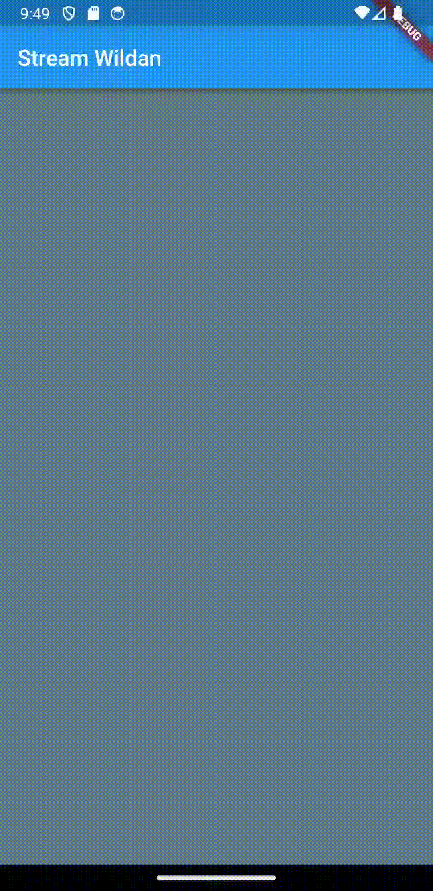

### Week 13

### Lanjutan State Management dengan Streams

Wildan Hafidz Mauludin

2141720007

### Praktikum 1: Dart Streams

**Soal 1**

- Tambahkan **nama panggilan Anda** pada `title` app sebagai identitas hasil pekerjaan Anda.

**Jawab**

```dart
class MyApp extends StatelessWidget {
  const MyApp({super.key});

  @override
  Widget build(BuildContext context) {
    return MaterialApp(
      title: 'Stream Wildan',
      theme: ThemeData(
        primarySwatch: Colors.blue,
      ),
      home: const StreamHomePage(),
    );
  }
}
```

- Gantilah warna tema aplikasi sesuai kesukaan Anda.

**Jawab**

```dart
return MaterialApp(
      title: 'Stream Wildan',
      theme: ThemeData(
        primarySwatch: Colors.blue,
      ),
      home: const StreamHomePage(),
    );
```

- Lakukan commit hasil jawaban Soal 1 dengan pesan "**W13: Jawaban Soal 1**".

**Jawab**

[W13: Jawaban Soal 1](https://github.com/nikoshaa/2141720007-mobile-2023/commit/d3d35324ee622a15d18b294f3a462a1210ad9400)

**Soal 2**

- Tambahkan 5 warna lainnya sesuai keinginan Anda pada variabel `colors` tersebut.

**Jawab**

```dart
import 'package:flutter/material.dart';

class ColorStream {
  final List<Color> colors = [
    Colors.blueGrey,
    Colors.amber,
    Colors.deepPurple,
    Colors.lightBlue,
    Colors.teal,
    // Tambah 5 warna
    Colors.lightGreenAccent,
    Colors.deepOrange,
    Colors.deepOrangeAccent,
    Colors.lime,
    Colors.lightGreen,
  ];
}
```

- Lakukan commit hasil jawaban Soal 2 dengan pesan "**W13: Jawaban Soal 2**"

**Jawab**

[W13: Jawaban Soal 2](https://github.com/nikoshaa/2141720007-mobile-2023/commit/5557361e38674d71ed66dfcc38fc4fe905615f2c)

**Soal 3**

- Jelaskan fungsi keyword yield\* pada kode tersebut!

**Jawab**

Keyword `yield*` pada kode tersebut digunakan untuk menghasilkan nilai dari generator lain. Dalam hal ini, `Stream.periodic` adalah generator yang menghasilkan nilai berulang setiap detik.

Keyword `yield*` mengambil nilai dari generator `Stream.periodic` dan mengembalikannya sebagai nilai dari generator yang sedang dibuat.

Dalam kode tersebut, generator yang dibuat menghasilkan nilai dari generator `Stream.periodic`.

- Apa maksud isi perintah kode tersebut?

**Jawab**

Kode tersebut mendefinisikan kelas `ColorStream` yang memiliki metode `getColors` sebagai asynchronous generator function, yang mana akan menghasilkan stream warna yang berulang setiap detik, dengan warna yang ditampilkan merupakan warna yang diambil dari daftar warna yang telah ditentukan.

- Lakukan commit hasil jawaban Soal 3 dengan pesan "W13: Jawaban Soal 3"

**Jawab**

[W13: Jawaban Soal 3](https://github.com/nikoshaa/2141720007-mobile-2023/commit/200c62aa386e87e7ec520a149775f337a8b88d8f)

**Soal 4**

- Capture hasil praktikum Anda berupa GIF dan lampirkan di README.

**Jawab**



- Lakukan commit hasil jawaban Soal 4 dengan pesan "**W13: Jawaban Soal 4**"

**Jawab**

[W13: Jawaban Soal 4]()
